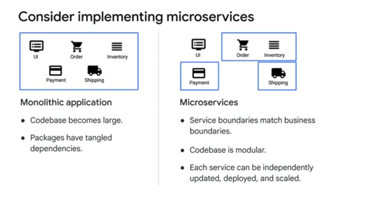
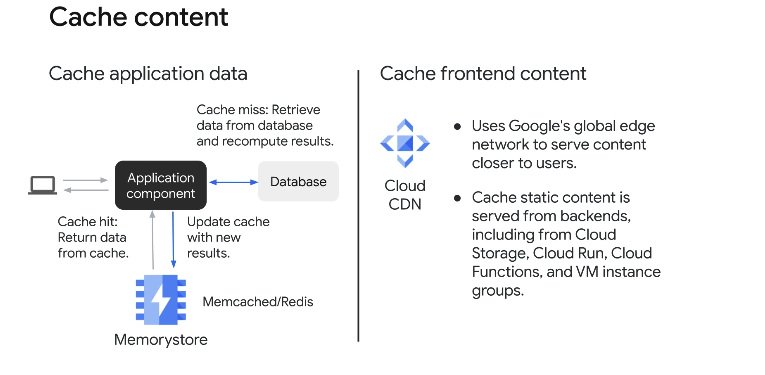
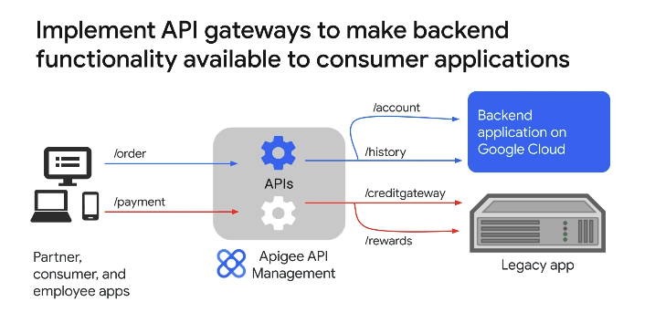
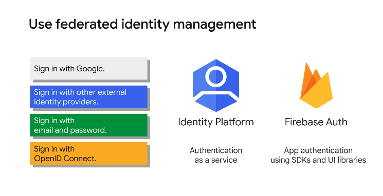
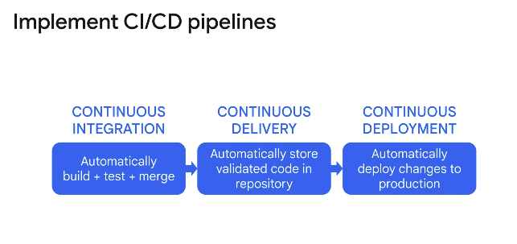
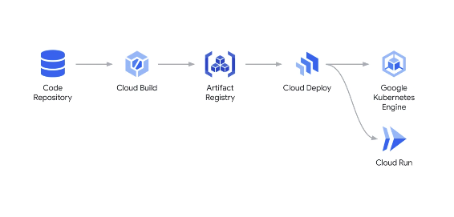
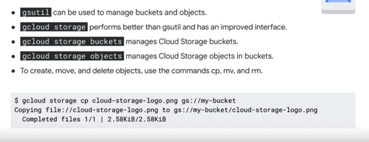

# Developing Applications with Google Cloud: Foundations

Contents:
* [Best Practices for Cloud Application Development](#best-practices-for-cloud-application-development)
* [Getting Started with Google Cloud Development](#getting-started-with-google-cloud-development)
* [Data Storage Options]
* [Handling Authentication and Authorization]
* [Adding Intelligence to Your Application]
* [Deploying Applications]
* [Compute Options for Your Application]
* [Monitoring and Performance Testing]

## Best Practices for Cloud Application Development
Applications built in the cloud should be built for:
- Global reach
- Scalability and high avaliability
- Security

Best Practices for application code and environment:
- Use code repository
- Do not store external dependencies in code repo (use dependency manager like package.json)
- Separate configuration settings from the code (use environment variables)

Consider microservices over monolithic application
- Monolithic applications typically have tangled dependencies and large code bases
- Microservices allow a modular codebase, and each service can be updated and deployed independently

Perform asynchronnous operations
- keep operations that happen in user thread to a minimum
- Use event-driven operations whenever possible
- preform backend operations asynchronously

Design for loose coupling
- Eventarc trigger for event queue, Pub/Sub for message queue
- Consumers of HTTP APIs should bind loosely with publisher payloads

Implement stateless components for scalability
- Workers perform compute tasks without sharing state, so they can scale up and down reliably
- Data should be persistent in another data store

Handle transient and long-lasting errors gracefully
- for transient errors, retry with exponential backoff
- for long-lasting errors, Implement a circuit breaker
- For user sent errors, handle more gracefully than just sending error back to user

Cache content:
- cache data that is frequently accessed or that is computationally intensive to calculate each time
- Memory store for google cloud

Cache frontend content
- uses cloud cdn to cache static frontend data

Apigee API
- Apigee acts as a facade for your backend service APIs, and provides security, rate limiting, quotas, analytics, and more.

Identity Platform

Set up logging and monitor application performance
- Logs constitute a continuous stream of events that keep occurring as long as the application is running
- Do not manage log files in your application --> Instead, write to an event stream like stdout and let the underlying infrastructure collate all events for later analysis and storage. 
- Allows for log-based metrics and trace requests

Implement CI/CD Pipelines
- automation increases velocity and reliability
- Lowers risk of regressions and allows easy rollouts

Strangler patter for rearchitect applications
- Incrementally replace components of the old application with new services

## Getting Started with Google Cloud Development

### Cloud APIs and the Google Cloud SDK
- APIs provide programattic interfaces to GCloud services
- HTTP request with JSON or gRPC requests
- gRPC is an open source, remote procedure call framework that can be run anywhere and uses an efficient binary request structure.
- SDK has two categories: command line tools and language-specific Cloud Client Libraries

### The Google Cloud CLI
- The Google Cloud Command Line Interface, or gcloud CLI, provides tools to manage Google Cloud services from the command line or in automated scripts.
- Same functionality as Cloud APIs in command line interface
- Combine authentication from api calls and can combine api calls for a single task
- gcloud: google cloud services
- gsutil: google cloud storage

- **gcloud components list** describes each of the CLI components
- **gloud storage** is now the preferred command line tool for managing cloud storage

- bq: big query commands
    - Manages datasets, tables, other BQ entities
    - Runs queries

### Cloud Client Libraries
- The Cloud Client Libraries are the recommended method for accessing Google Cloud resources from your applications.
- easier than API calls
- Automatically handle auth and retry logic
- Automatiically call gRPC apis
- python, node, java, go, php, ruby, C++, and .NET

### Cloud Shell and Cloud Code
- Cloud shell is a free admin machien with browser-based command line access from the GCloud console
- It provides you with a temporary virtual machine instance that has 5 GB of persistent disk storage.
- When you start Cloud Shell, it provisions a Compute Engine virtual machine that runs a Debian-based Linux operating system.
- Cloud Shell instances are provisioned on a per-user, per-session basis. 
- Cloud SDK is preinstalled in cloud shell
- Built in code editor based on Theia
- Cloud Code is a set of IDE plugins that make it easier to create, deploy, and debug cloud applications for Google Cloud.
- Cloud Code for Kubernetes allows user to develop Kubernetes applications in your IDE
- Local emulators allow developers to test and debug code before launching to cloud hosting
- Cloud Workstations:  provides fully managed and secure cloud-based development environments for Google Cloud.
    - Developers can access fast and consistent development environments anytime and anywhere, using a browser, SSH, or a local IDE.
    - Cloud Workstations supports any code editors and applications that can be run in a container.
    - Cloud Workstations runs on ephemeral Compute Engine VMs, and can be started or stopped on demand or when the IDE is idle to improve cost savings.